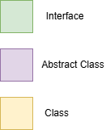

El disseny proposat és el següent:

| Tipus          | Nom         | Descripcio                                                                                                                                             |
|----------------|-------------|--------------------------------------------------------------------------------------------------------------------------------------------------------|
| Interfície     | NonPlayable | Conte una serie d'atributs *(int healthPoints)* i metodes *(void move() , void interact())* que seran implementats a tots els personatges no jugables. |
| Interfície     | Pet         | Conte una serie de metodes *(void play() , void feed())* que seran implementats a totes les classes que considerem com a mascotes.                     |
| Classe Abstracta | Animal      | Classe abstracta que agrupa a tots els animals i implementa comportaments de personatge no jugable.                                                    |
| Classe Abstracta | Robot       | Classe abstracta que agrupa a tots els robots i implementa comportaments de personatge no jugable.                                                     |
| Classe Abstracta | Canine      | Classe abstracta que hereda atributs i metodes d'Animal, agrupa a a tots els animals canins i implementa comportaments de personatge no jugable.       |
| Classe Abstracta | Feline      | Classe abstracta que hereda atributs i metodes d'Animal, agrupa a a tots els animals felins i implementa comportaments de personatge no jugable.       |
| Classe | Agent       | Classe que hereda atributs i metodes de Robot.                                                                                                         |
| Classe | RoboDog     | Classe que hereda atributs i metodes de Robot i implementa comportament de Pet.                                                                        |
| Classe | Hippo       | Classe que hereda atributs i metodes d'Animal.                                                                                                         |
| Classe | Wolf        | Classe que hereda atributs i metodes de Canine.                                                                                                        |
| Classe | Dog         | Classe que hereda atributs i metodes de Canine i implementa comportament de Pet.                                                                       |
| Classe | Tiger       | Classe que hereda atributs i metodes de Feline.                                                                                                        |
| Classe | Lion        | Classe que hereda atributs i metodes de Feline.                                                                                                        |
| Classe | Cat         | Classe que hereda atributs i metodes de Feline i implementa comportament de Pet.                                                                       |
| Classe | Player      | Classe que conte un ArrayList de Pet (totes les classes que tenen implementades el comportament de Pet).                                               |
