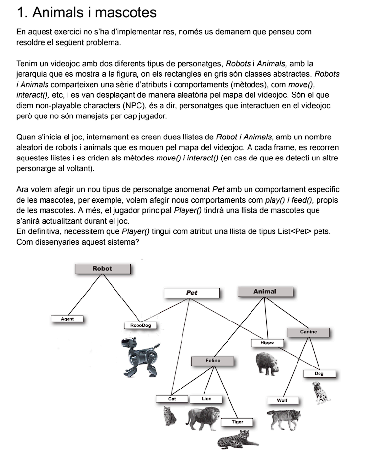

El disseny proposat es el següent:

| Tipus            | Nom         | Descripcio                                                                                                                                              |
|------------------|-------------|---------------------------------------------------------------------------------------------------------------------------------------------------------|
| Interfície       | NonPlayable | Conte una serie d'atributs *(int healthPoints)* i metodes *(void move() , void interact())* que seran implementats a tots els NPC.                      |
| Classe Abstracta | Pet         | Plantilla per aot animal domesticable, que tindra uns estats comuns i un comportament particular en funcio del tipus d'animal (metodes abstractes).     |