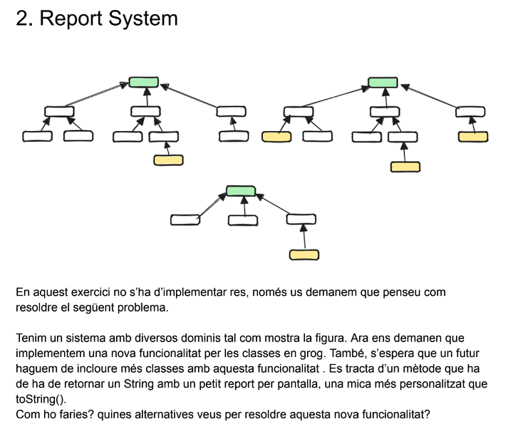
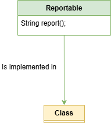

Per a solucionar aquest plantejament, crearia una interficie:

| Tipus          | Nom        | Descripcio                                                                                                  |
|----------------|------------|-------------------------------------------------------------------------------------------------------------|
| Interfície     | Reportable | Conte un mètode *String report()* que sera implementat a totes les classes que hagin de retornar un report. |

D'aquesta forma, totes les classes (i futures classes) que ho necessitin podran implementar aquest mètode, que tornarà un report que podrem personalitzar per a cada implementació.

La representació visual seria la següent (per a cada classe que desitgem implementar el mètode *report()*):

