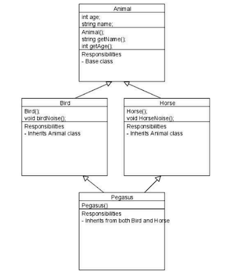
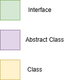
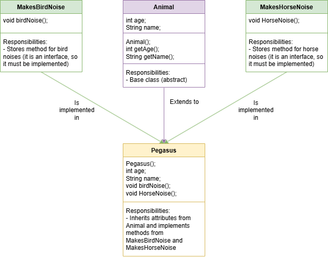

# Solucio aportada

Per a resoldre aquest problema del diamant, he convertit les classes Bird i Horse en dues interfícies, de forma que tenim el següent:

| Tipus            | Nom             | Descripcio                                                                                                                                |
|------------------|-----------------|-------------------------------------------------------------------------------------------------------------------------------------------|
| Interfície       | MakesBirdNoise  | Conte un mètode birdNoise(void), que retorna un text d'un ocell piolant.                                                                  |
| Interfície       | MakesHorseNoise | Conte un mètode horseNoise(void), que retorna un text d'un cavall relinxant.                                                              |
| Classe Abstracta | Animal          | Té els atributs age (int) i name (String). Aquesta classe serveix de plantilla.                                                           |
| Classe           | Pegasus         | Hereta els atributs de la classe Animal i implementa les interfícies MakesBirdNoise i MakesHorseNoise de forma que pot piolar i relinxar. |

El diagrama inicial era el següent:

El diagrama ideat per a la solució és el següent:

S'ha creat la classe TestHerenciaMultiple per a comprovar que la solució mencionada funciona correctament.
